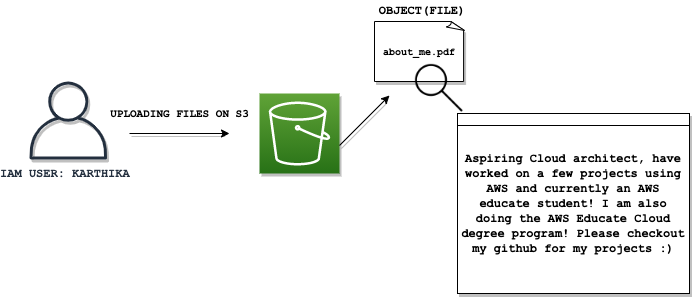

### 
Hi :) 

I am: 
* Third-year student at San Jose State University, majoring in Software Engineering. 
* AWS Edcuate Cloud Degree program student.

Experience: 
* Incoming Solutions architect intern @ Amtrak for the Winter/Spring.
* Incoming Tech Audit (CyberSecurity) @ Verizon for the Summer.

Please reach me at: karthika.thiruvallur@gmail.com 

<!--

**ttkart/ttkart** is a ✨ _special_ ✨ repository because its `README.md` (this file) appears on your GitHub profile.

Here are some ideas to get you started:

- 🔭 I’m currently working on ...
- 🌱 I’m currently learning ...
- 👯 I’m looking to collaborate on ...
- 🤔 I’m looking for help with ...
- 💬 Ask me about ...
- 📫 How to reach me: ...
- 😄 Pronouns: ...
- ⚡ Fun fact: ...
-->
